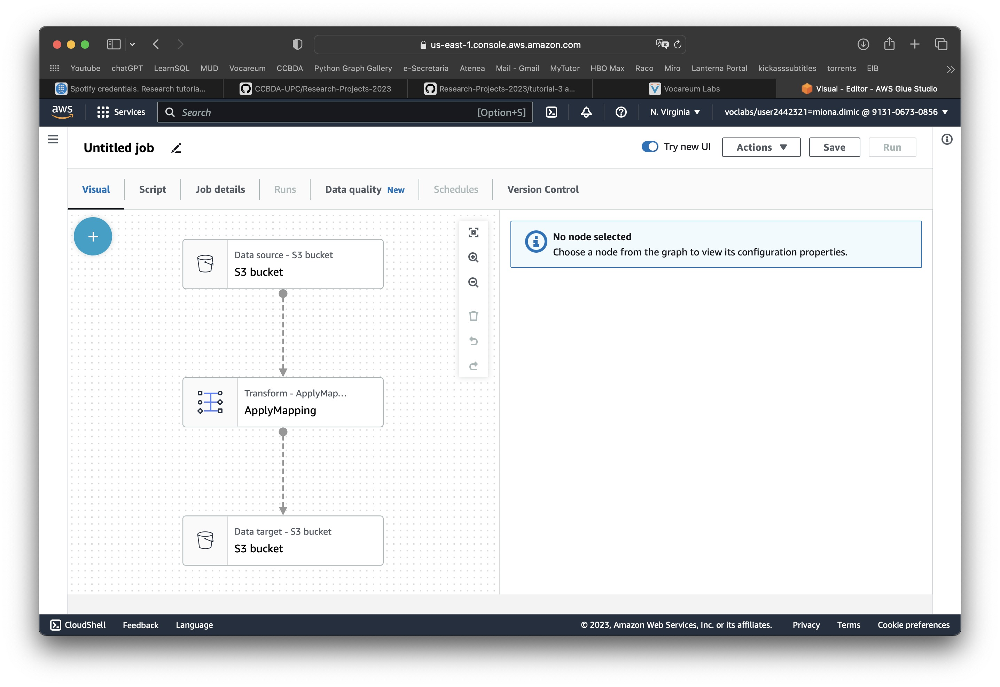

1. Immediately we run into the first issue, since the buckets names need to be unique globally, and the team who created the tutorial already used the names 'landing.zone.bucket' and 'formatted.zone.bucket' it's impossible for us to create the buckets with the same names. Thus we will use 'landing.zone.bucket1' and 'formatted.zone.bucket1'. 

After which we have uploaded the players.csv data into the landing zone bucket.

2. We then have created the AWS glue job according to the instructions

3. Then we have filled out the details of the job according to the instructions and have saved it

4. Finally we have followed the instructions for adding the steps to our ETL process and saved the outcome.

5. However when trying to run the job both times we hit an error.

As seen on the screenshot it was due to the error with the FillMissingValues element of our ETL process. After removing it from the ETL flow, the job finished successfully.

We made sure that it worked correctly by checking the formatted zone bucket, and it indeed had now newly created parquet files as intended.

All in all, it was a fairly well structured, albeit a little simple, tutorial on using a new tool that was previously unknown to us. I would give this an 8.5 as the score. 